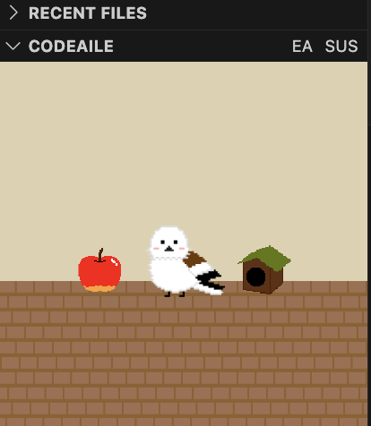
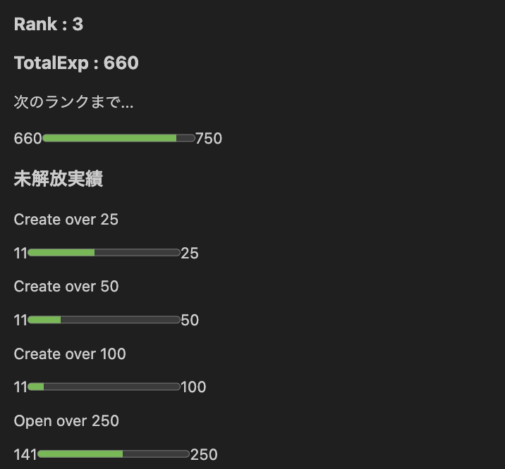

# CodeAile

開発を日常的に行うことで様々な実績を達成し、バーチャルペット(Aile)を育成することで、自身の成長が可視化される機能を提供します。

## 機能

### バーチャルペット(Aile)の育成

VScodeのサイドバーを部屋に見立て、その中でペットを育成することができます。

ペットはプレイヤーランクに応じて進化させることが可能になります。

進化可能な状態であれば、画面例にある、EA(Evolve Aile)ボタンを押すことで、Aileが進化します。

- 実行画面例

### 実績システム

VScode上での操作を追跡し、以下に示す操作を元にした実績が用意されている。

- ソースファイルを作成した回数
- ソースファイルを開いた回数
- ソースファイルを編集した行数
- ソースファイルをデバッグした回数
- ソースファイルを作成した種類数
- ソースファイルを開いた種類数
- ソースファイルをデバッグした種類数
- 今までの開発日数
- 連続での開発日数
- 今までの開発時間

実行画面例にあるSUS(Show User Status)ボタンを押すことで、現在のステータス・実績の達成状況を確認することができます。

